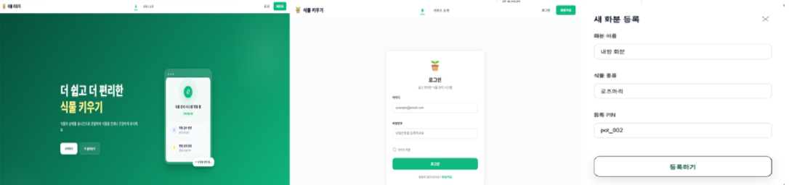
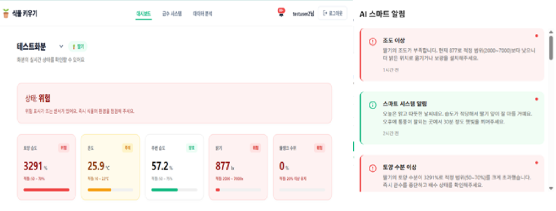
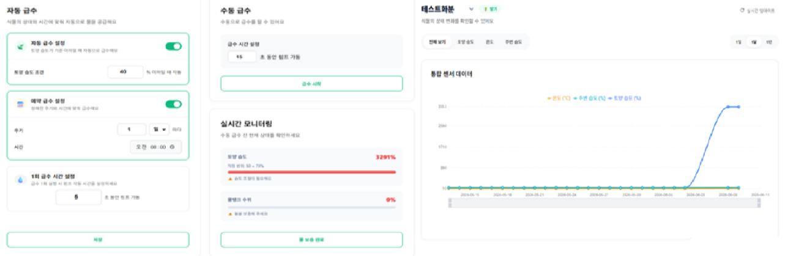
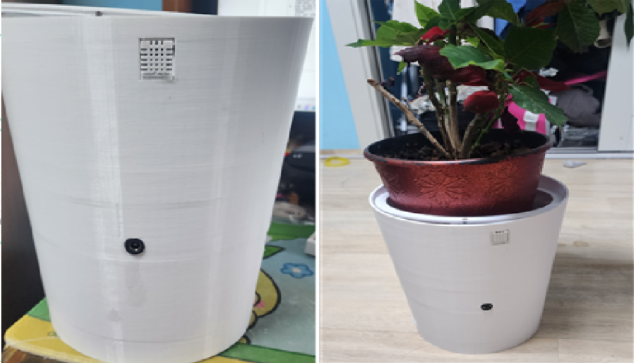
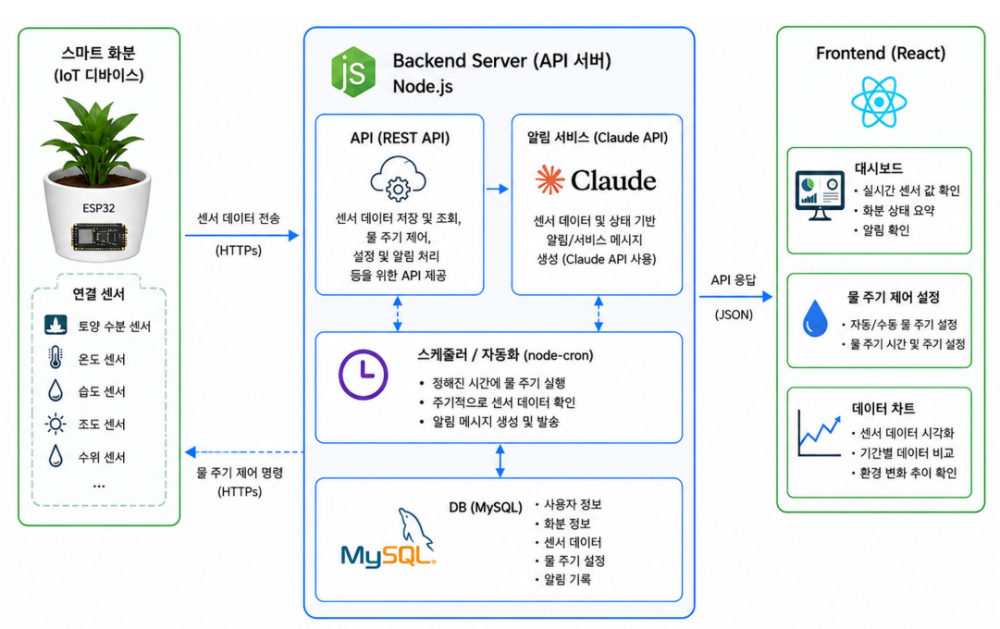

# 🌱 Smart Plant Management System

## 스마트 화분 관리 시스템

> **센서 데이터와 웹 서비스를 활용한 IoT 기반 식물 관리 시스템**
> 스마트 화분 관리 시스템은 사용자가 식물의 생육 환경을 웹에서 확인하고, 토양 습도 상태에 따라 수동 또는 자동으로 급수할 수 있도록 지원하는 IoT 기반 식물 관리 플랫폼입니다.
> ESP32 센서를 통해 온도, 습도, 토양 습도, 조도, 물통 잔량 데이터를 수집하고, React 대시보드와 Node.js 서버를 통해 실시간 모니터링 및 급수 제어 기능을 제공합니다. 또한 Claude API를 활용하여 날씨 정보와 센서값 기반의 식물 관리 알림을 제공합니다.

---

## 🎯 핵심 가치 (Core Values)

### 🌿 Data-Based Plant Care

사용자의 감각에 의존하던 식물 관리를 센서 데이터 기반으로 전환하여, 토양 습도와 주변 환경을 수치로 확인할 수 있도록 지원합니다.

### 💧 Remote & Automated Watering

웹 애플리케이션을 통해 원격으로 물 주기 기능을 실행하거나, 토양 습도 기준값에 따라 자동 급수가 이루어지도록 구현했습니다.

### 🔔 AI-Powered Notification

Claude API를 활용하여 날씨 정보와 센서값을 기반으로 식물 관리에 필요한 알림을 생성하고, 사용자가 쉽게 이해할 수 있는 문장으로 안내합니다.

---

## ✨ 주요 기능 (Key Features)

### 🖥️ 1. 웹 기반 화분 관리

* **회원가입 및 로그인**: 사용자별 계정 기반으로 화분 정보를 관리할 수 있습니다.
* **화분 등록**: 사용자가 관리할 화분을 등록하고 선택할 수 있습니다.
* **메인 화면 구성**: 서비스 소개, 로그인, 화분 등록 및 관리 기능으로 이동할 수 있는 기본 화면을 제공합니다.

### 📊 2. 센서 데이터 대시보드

* **실시간 센서값 확인**: 온도, 습도, 토양 습도, 조도, 물통 잔량 데이터를 웹 화면에서 확인할 수 있습니다.
* **화분별 데이터 관리**: 등록된 화분별로 센서 데이터를 구분하여 저장하고 조회할 수 있습니다.
* **시각적 대시보드**: 주요 센서값을 카드 및 차트 형태로 제공하여 현재 상태를 직관적으로 파악할 수 있습니다.

### 💦 3. 차트 분석 및 급수 시스템

* **센서 데이터 차트 분석**: 시간에 따른 온도, 습도, 토양 습도, 조도 변화를 차트로 확인할 수 있습니다.
* **수동 급수 기능**: 사용자가 웹에서 직접 물 주기 명령을 실행할 수 있습니다.
* **자동 급수 기능**: 토양 습도 기준값 이하로 떨어질 경우 자동 급수가 실행되도록 설정할 수 있습니다.
* **급수 기록 저장**: 수동 또는 자동 급수 실행 기록을 저장하여 관리 이력을 확인할 수 있습니다.

### 🔔 4. Claude API 기반 알림 서비스

* **날씨 기반 알림**: 외부 날씨 정보를 바탕으로 식물 관리에 주의가 필요한 상황을 안내합니다.
* **센서값 기반 알림**: 토양 습도, 온도, 습도, 조도 등의 센서값을 분석하여 관리가 필요한 경우 알림을 제공합니다.
* **사용자 친화적 문장 생성**: 단순 수치가 아닌 식물 관리 관점의 안내 문장을 생성하여 사용자가 쉽게 이해할 수 있도록 구성했습니다.

### 🪴 5. 스마트 화분 하드웨어 연동

* **ESP32 기반 센서 수집**: ESP32를 통해 토양 습도, 온습도, 조도, 무게 센서 데이터를 수집합니다.
* **물통 잔량 계산**: HX711 무게센서를 통해 물통의 무게를 측정하고, 남은 물의 양과 잔량 비율을 계산합니다.
* **워터펌프 제어**: 릴레이 모듈을 통해 워터펌프를 제어하여 실제 급수 동작이 이루어지도록 구현했습니다.
* **3D 프린터 기반 화분 제작**: 센서와 펌프, 제어 모듈이 배치될 수 있는 스마트 화분 구조물을 제작했습니다.

---

## 🌐 배포 주소

본 프로젝트는 아래 배포 주소를 통해 실제 웹 서비스 형태로 확인할 수 있습니다.

- **Service URL**: [https://farm.nulldns.top](https://farm.nulldns.top)

로그인 없이 주요 화면과 기능 흐름을 확인할 수 있는 미리보기 모드를 제공합니다.

- **Demo Preview**: [https://farm.nulldns.top/demo](https://farm.nulldns.top/demo)

> 미리보기 모드는 샘플 데이터를 기반으로 동작하며, 실제 급수 제어 기능은 실행되지 않습니다.

---

## 🖼️ 실행 화면 (Execution Screens)

### 🏠 1. 메인화면, 로그인, 화분 등록 화면

<!-- 이미지 위치: docs/main-login-register.png -->



사용자는 메인화면에서 서비스에 접근하고, 회원가입 및 로그인을 통해 개인 계정으로 접속할 수 있습니다. 로그인 후에는 관리할 화분을 등록하고 선택하여 해당 화분의 상태를 확인할 수 있습니다.

---

### 🔔 2. 알림 및 대시보드

<!-- 이미지 위치: docs/notification-dashboard.png -->



대시보드에서는 현재 화분의 온도, 습도, 토양 습도, 조도, 물통 잔량 등의 센서값을 확인할 수 있습니다. 또한 Claude API를 활용하여 날씨 정보와 센서값 기반의 식물 관리 알림을 제공합니다.

---

### 📈 3. 차트 분석 및 급수 시스템

<!-- 이미지 위치: docschart-watering-system.png -->



수집된 센서 데이터는 차트 형태로 시각화되어 시간에 따른 변화 추이를 확인할 수 있습니다. 사용자는 토양 습도 기준값을 설정하여 자동 급수 조건을 구성하거나, 필요할 경우 수동 급수를 실행할 수 있습니다.

---

### 🪴 4. 스마트 화분 하드웨어

<!-- 이미지 위치: docs/smart-planter-hardware.png -->



스마트 화분 하드웨어는 ESP32, 토양 습도 센서, 온습도 센서, 조도 센서, 무게센서, 워터펌프, 릴레이 모듈을 결합하여 제작했습니다. 센서 데이터 수집과 급수 제어가 실제 화분 구조 안에서 동작하도록 구성했습니다.

---

## 🛠️ 기술 스택 (Technical Stack)

### ⚛️ Frontend

* **Framework**: React
* **Language**: JavaScript, HTML5, CSS3
* **Network**: Axios / Fetch API
* **Visualization**: Chart.js 또는 Recharts
* **Main Features**: 로그인, 화분 등록, 대시보드, 센서 데이터 차트, 급수 설정, 알림 화면

### 🟩 Backend

* **Runtime**: Node.js
* **Framework**: Express
* **Authentication**: JWT, bcrypt
* **Database Connection**: mysql2
* **Scheduler**: node-cron
* **Main Features**: 사용자 인증, 화분 관리, 센서 데이터 저장 및 조회, 급수 설정, 급수 명령 처리, 알림 생성

### 🗄️ Database

* **DBMS**: MySQL
* **Main Tables**

  * `users`: 사용자 정보
  * `pot`: 화분 정보
  * `sensor_data`: 센서 데이터
  * `watering_settings`: 급수 설정
  * `watering_logs`: 급수 기록
  * `notifications`: 알림 정보

### 🔌 IoT & Hardware

* **Board**: ESP32 DevKit
* **Sensors**

  * DHT22 온습도 센서
  * 정전식 토양 습도 센서
  * 조도 센서
  * HX711 + 로드셀 무게센서
* **Actuator**

  * 5V 워터펌프
  * 릴레이 모듈
* **Communication**: Wi-Fi, HTTP API
* **Structure**: 3D 프린터 기반 스마트 화분 외형 제작

### 🤖 AI & External API

* **AI API**: Claude API
* **Notification Logic**

  * 날씨 정보 기반 식물 관리 알림
  * 센서값 기반 상태 알림
  * 토양 습도 및 환경 조건 기반 관리 안내

### ☁️ Deployment

* **Cloud**: Oracle Cloud Infrastructure
* **Web Server**: Nginx
* **Process Manager**: PM2
* **Database Server**: MySQL

---

## 🏗️ 시스템 아키텍처 및 설계 원칙

### 🧩 1. 전체 시스템 구조

<!-- 이미지 위치: docs/architecture-diagram.png -->



본 프로젝트는 ESP32 기반 하드웨어, Node.js 백엔드 서버, MySQL 데이터베이스, React 프론트엔드, Claude API 기반 알림 서비스로 구성됩니다.

1. ESP32가 센서를 통해 화분의 환경 데이터를 수집합니다.
2. 수집된 데이터는 Wi-Fi를 통해 백엔드 서버로 전송됩니다.
3. 백엔드 서버는 데이터를 MySQL 데이터베이스에 저장합니다.
4. 프론트엔드는 백엔드 API를 통해 센서 데이터를 조회합니다.
5. 사용자는 웹 대시보드에서 현재 센서값과 차트를 확인합니다.
6. 서버는 날씨 정보와 센서값을 기반으로 알림 조건을 판단합니다.
7. Claude API를 활용하여 사용자에게 전달할 알림 문구를 생성합니다.
8. 사용자는 웹 화면에서 알림을 확인하고 필요한 조치를 수행합니다.
9. 수동 급수 또는 자동 급수 조건이 충족되면 워터펌프가 동작합니다.
10. 급수 결과는 데이터베이스에 기록됩니다.

### 🟩 2. 백엔드 설계 원칙 (Backend)

* **API 중심 구조**
  프론트엔드, ESP32, 데이터베이스가 백엔드 API를 중심으로 연결되도록 구성했습니다.

* **사용자별 데이터 분리**
  JWT 인증을 통해 로그인한 사용자가 자신의 화분 데이터에 접근할 수 있도록 설계했습니다.

* **센서 데이터 저장 및 조회 분리**
  센서 데이터 저장 API와 조회 API를 분리하여 하드웨어 데이터 수집과 웹 대시보드 조회가 독립적으로 동작하도록 구성했습니다.

* **급수 명령 처리 구조**
  웹에서 발생한 수동 급수 명령 또는 자동 급수 조건을 서버가 관리하고, ESP32가 주기적으로 명령을 확인하여 워터펌프를 제어하도록 구성했습니다.

* **알림 생성 구조**
  날씨 정보와 센서값을 기반으로 알림 조건을 판단하고, Claude API를 통해 사용자가 이해하기 쉬운 알림 문구를 생성하도록 설계했습니다.

### ⚛️ 3. 프론트엔드 설계 원칙 (Frontend)

* **컴포넌트 기반 화면 구성**
  로그인, 화분 등록, 대시보드, 차트, 급수 설정, 알림 화면을 컴포넌트 단위로 구성하여 유지보수성을 높였습니다.

* **대시보드 중심 UI**
  사용자가 현재 화분 상태를 빠르게 파악할 수 있도록 센서값 카드와 차트를 중심으로 화면을 구성했습니다.

* **사용자 친화적 관리 흐름**
  화분 등록 → 대시보드 확인 → 알림 확인 → 급수 설정 및 실행으로 이어지는 흐름을 제공하여 사용자가 쉽게 식물을 관리할 수 있도록 했습니다.

### 🔧 4. 하드웨어 설계 원칙 (Hardware)

* **센서 데이터 기반 관리**
  토양 습도, 온도, 습도, 조도, 물통 잔량을 측정하여 식물 관리 판단에 필요한 데이터를 수집했습니다.

* **실제 급수 동작 구현**
  워터펌프와 릴레이 모듈을 활용하여 웹에서 발생한 급수 명령이 실제 하드웨어 동작으로 이어지도록 구현했습니다.

* **물통 잔량 계산**
  무게센서를 통해 측정한 물통 무게를 기반으로 남은 물의 양을 계산하고, 이를 서버로 전송하여 대시보드와 알림에 활용할 수 있도록 했습니다.

---

## 🚀 API 명세 및 시작하기 (Getting Started)

### 📁 1. 프로젝트 구조

```bash
smart-plant-management-system
├── backend
│   ├── src
│   ├── routes
│   ├── controllers
│   ├── services
│   ├── config
│   └── package.json
├── frontend
│   ├── src
│   ├── public
│   └── package.json
├── arduino
│   └── smart_planter_esp32
├── docs
│   └── images
│       ├── main-login-register.png
│       ├── notification-dashboard.png
│       ├── chart-watering-system.png
│       ├── smart-planter-hardware.png
│       └── architecture-diagram.png
└── README.md
```

> 실제 프로젝트 폴더 구조에 따라 위 구조는 수정해서 사용하면 됩니다.

---

### 🟩 2. Backend Setup

```bash
# 1. backend 폴더로 이동
cd backend

# 2. 패키지 설치
npm install

# 3. 환경 변수 파일 생성
# .env 파일을 생성하고 아래 항목을 프로젝트 환경에 맞게 입력
```

```env
PORT=3001

DB_HOST=localhost
DB_USER=your_db_user
DB_PASSWORD=your_db_password
DB_NAME=smart_pot

JWT_SECRET=your_jwt_secret

ANTHROPIC_API_KEY=your_claude_api_key
OPENWEATHER_API_KEY=your_weather_api_key

```

```bash
# 4. 개발 서버 실행
npm run dev

# 또는 일반 실행
npm start
```

---

### ⚛️ 3. Frontend Setup

```bash
# 1. frontend 폴더로 이동
cd frontend

# 2. 패키지 설치
npm install

# 3. 환경 변수 파일 생성
# .env 파일을 생성하고 아래 항목을 프로젝트 환경에 맞게 입력
```

```env
REACT_APP_API_BASE_URL=http://localhost:3001/api
```

```bash
# 4. 개발 서버 실행
npm start

# 또는 Vite 기반 프로젝트인 경우
npm run dev
```

---

### 🔌 4. ESP32 Arduino Setup

ESP32 코드는 `arduino/smart_pot` 폴더에 위치합니다.

#### 📚 사용 라이브러리

* WiFi
* HTTPClient
* ArduinoJson
* DHT sensor library
* HX711

#### ⚙️ 주요 설정값

```cpp
const char* WIFI_SSID = "your_wifi_ssid";
const char* WIFI_PASS = "your_wifi_password";

const char* API_BASE_URL = "http://your-server-address";
const char* DEVICE_ID = "esp32-001";
const int POT_ID = 1;
```

#### 📍 주요 센서 및 핀 구성 예시

```cpp
#define DHT_PIN 4
#define SOIL_PIN 34
#define LIGHT_PIN 35
#define RELAY_PIN 26
#define HX711_DT 18
#define HX711_SCK 19
```

> 실제 배선 상태에 따라 핀 번호는 수정해서 사용해야 합니다.

---

### 🗄️ 5. Database Setup

MySQL에 프로젝트용 데이터베이스를 생성합니다.

```sql
CREATE DATABASE smart_pot;
USE smart_pot;
```

주요 테이블은 다음과 같이 구성됩니다.

* `users`
* `pot`
* `sensor_data`
* `watering_settings`
* `watering_logs`
* `notifications`

---

## 📡 주요 API 예시

### 🔐 Auth

```http
POST /api/auth/register
POST /api/auth/login
```

### 🪴 Pot

```http
POST /api/plant/register
GET /api/pots
```

### 📊 Sensor Data

```http
POST /api/sensor-data
GET /api/sensor-data/:potId
```

### 💧 Watering

```http
POST /api/watering/manual
GET /api/watering/settings/:potId
POST /api/watering/settings
GET /api/watering/logs/:potId
```

### 🔔 Notification

```http
GET /api/notifications/:potId
POST /api/notifications/generate
```

---

## 📌 최종 결과물 요약

| 구분       | 내용                                      |
| -------- | --------------------------------------- |
| 웹 애플리케이션 | 메인화면, 로그인, 화분 등록, 대시보드 구현               |
| 데이터 시각화  | 센서 데이터를 차트 형태로 시각화                      |
| 급수 시스템   | 수동 급수 및 토양 습도 기준 자동 급수 기능 구현            |
| 알림 서비스   | Claude API 기반 날씨 및 센서값 알림 제공            |
| 하드웨어     | ESP32, 센서, 릴레이, 워터펌프, 무게센서 기반 스마트 화분 제작 |
| 배포       | OCI 서버, Nginx, PM2 기반 웹 서비스 배포          |

---

## 👥 팀원 (Team)

| 이름 | 역할 | 주요 수행 내용 |
|---|---|---|
| 홍태성 | 백엔드 및 하드웨어 개발 | DB 및 인프라 구성, 3D 프린터 기반 스마트 화분 제작, 센서 데이터 API 구현, ESP32 개발 |
| 안효성 | 백엔드 개발 | Node.js 기반 API 구현, Claude API 기반 알림 서비스 구현, 로그인/회원가입 API 구현 |
| 서민식 | 백엔드 개발 | Node.js 기반 API 구현, 화분 등록 및 화분 도감 API 구현 |
| 김혜성 | 프론트엔드 개발 | React 기반 웹 화면 구현, 메인화면, 대시보드 UI 등 전체 UI 화면 구성, API 연동 |

---

## 🏷️ Release

최종 제출 버전은 GitHub Release를 통해 확인할 수 있습니다.

```text
https://github.com/tshong3/smart_pot/releases/tag/v1.0.0
```
